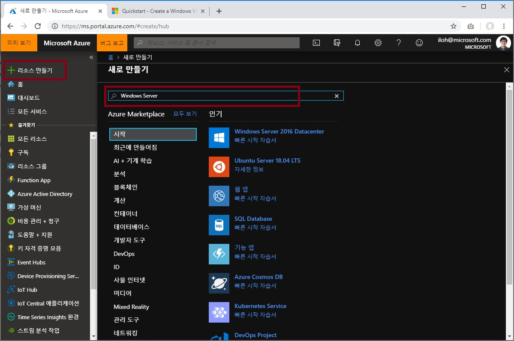
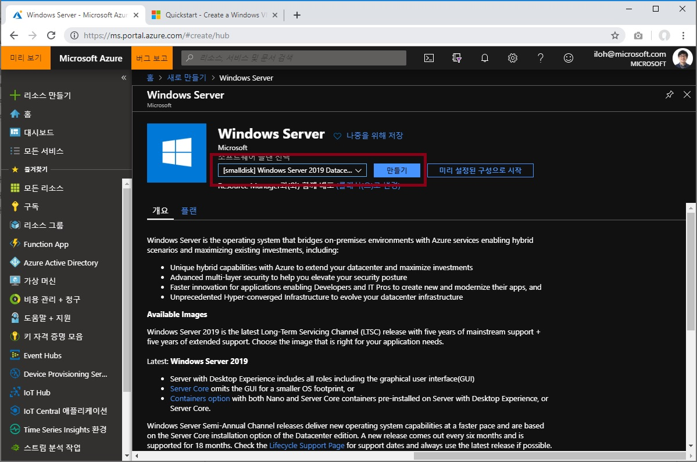
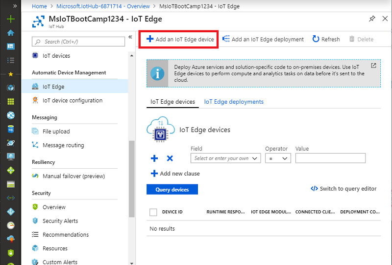
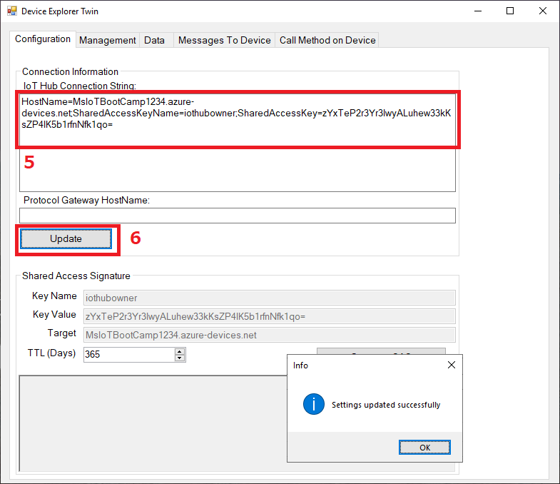

# Windows Server 2019 + Azure IoT Edge (45분)

많은 경우 Windows Server 2019 서버가 IoT Edge 게이트웨이 역할을 하면서 로컬의 디바이스와 센서들을 클라우드에 연결 할 수 있습니다. 이번 실습에서는 Windows 2019 가상컴퓨터에 IoT Edge를 설치해서 모듈을 배포해보겠습니다. 특히 Azure 마켓플레이스에 등록된 IoT Edge 모듈을 사용하는 방법도 살펴보겠습니다.

이번 실습을 통해서 

1. Azure IoT Hub 만들기
2. IoT Hub에 Azure IoT Edge 디바이스 생성
3. Windows Server 2019에 Azure IoT Edge 런타임 설치
4. Azure 마켓플레이스에 있는 모듈 설치하기

## Prerequisites

- Azure 구독  

  구독이 없으면 [무료 체험계정 만들기](https://azure.microsoft.com/ko-kr/free/)
  

## Step 0 : Windows Server 2019 가상머신 만들기 

Azure IoT Edge가 작동될 Windows Server 2019 가상머신을 Azure에 만듭니다.

### Step 0-1 : Azure에 로그인 

[Azure 포탈](https://portal.azure.com)에 로그인합니다.

### Step 0-2 : Windows Server 2019 새로 만들기

포탈의 왼쪽 위에 "리소스 만들기" 선택하고 Windows Server로 검색해서 Windows Server를 선택합니다.



소프트웨어 플랜을 Windows Server 2019 Datacenter로 선택하고 만들기를 선택합니다. 



### Step 0-3 : 가상머신 만들기

가상머신 만들기 문서를 따라서 진행합니다. 

[가상머신 만들기](https://docs.microsoft.com/ko-kr/azure/virtual-machines/windows/quick-create-portal#create-virtual-machine) 내용을 참조하여 Windows Server 2019 가상머신을 만듭니다.

### Step 0-4 : 가상머신에 연결

RDP를 활용해서 가상머신에 연결해 봅니다. 

[가상머신에 연결](https://docs.microsoft.com/ko-kr/azure/virtual-machines/windows/quick-create-portal#connect-to-virtual-machine)

## Step 1 : IoT Hub 만들기

[Azure 포탈](https://portal.azure.com)에서 Azure IoT Hub를 만듭니다. 

### Step 1.1 : [Azure 포탈](https://portal.azure.com)에 로그인

웹브라우저로 [http://portal.azure.com](http://portal.azure.com)에 접속한 후 로그인 합니다. 

### Step 1.2 : Azure IoT Hub 만들기

**Create a resource** -> **Internet of Things** -> **IoT Hub** 를 선택합니다. 


### Step 1.3 : IoT Hub 생성

4가지 파라미터를 입력하여 IoT Hub를 생성합니다. 

| 파라미터        | 설명                                     | 예                       |
| -------------- | ---------------------------------------- | ------------------------ |
| 구독           | Subscription to use for the new IoT Hub  | Azure Free Account       |
| Resource Group | Create a new Resource Group for this lab | IoTHOLGroup              |
| 지역           | Data center region nearest to you        | Korea Central            |
| IoT Hub 이름   | Provide a name that is globally unique   | MsIoTBootCamp1234        |

1. 4가지 값을 입력하여 IoT Hub를 만듭니다. 
2. IoT Hub 이름은 유일해야 합니다. 녹색 체크박스 확인  
3. **Next: Size and scale>>** 선택


### Step 1.4 : Size and Scale 선택

IoT Hub는 가격과 관련된 Scale과 크기가 있습니다. 각 Scale tier는 서로 다른 한도와 기능제약을 가지고 있습니다. 실제 시나리오에 맡는 크기와 Scale을 선택해야 합니다.

여기에서는 무료를 선택하고 `F1: Free tier for Pricing and scale tier` **Review + create** 를 클릭합니다.

> [!NOTE]  
> 무료 IoT Hub는 구독당 하나만 만들수 있습니다. 이미 F1 IoT Hub를 가지고 있다면 Standard 1 (S1)을 선택합니다. 


참조 : [https://docs.microsoft.com/en-us/azure/iot-hub/iot-hub-scaling](https://docs.microsoft.com/en-us/azure/iot-hub/iot-hub-scaling)

### Step 1.5 : IoT Hub 생성 시작

**Create** 버튼을 눌러 IoT Hub 인스턴스를 생성합니다. 


### Step 1.6 : 배포가 완료될 때까지 대기

배포가 완료될 때까지 기다립니다. 


> [!TIP]  
> `Notifications` 알림창을 통해서도 배포 진행상황을 확인 할 수 있습니다. 
>  
> 


## Step 2 : 새로운 Azire IoT Edge 디바이스 등록

이번엔 Windows Server 2019 가상머신을 위한 새로운 Azure IOT Edge Device를 등록합니다. 

### Step 2.1 : 생성한 IoT Hub에 들어갑니다. 

`Go to resource` 버튼을 눌러 IoT Hub에 들어갑니다. 


### Step 2.2 : IoT Edge 메뉴

IoT Edge 메뉴를 선택합니다


### Step 2.3 : IoT Edge 디바이스 추가

새로운 IoT Edge 디바이스를 추가합니다. 

Click **Add an IoT Edge device**  



### Step 2.4 : Device ID

디바이스 아이디는 IoT Edge 디바이스를 구분하는 ID로 사용됩니다. 

1. 유일한 이름을 사용합니다.   
  e.g. IoTHOLWindows2019-1

1. **Save** 클릭


### Step 2.5 : 새로운 IoT Edge 디바이스 확인

새로운 IoT Edge 디바이스를 **Refresh** 버튼을 눌러 확인합니다. 


## Step 3 : Connection string

IoT Edge 디바이스를 IoT Hub에 연결하려면 **Connection String**이 필요합니다. 디바이스 Connection String은 IoT Hub가 디바이스를 인증하는데 사용됩니다. 

향후 사용을 위해서 복사해 놓습니다. 

Reference : [https://devblogs.microsoft.com/iotdev/understand-different-connection-strings-in-azure-iot-hub/](https://devblogs.microsoft.com/iotdev/understand-different-connection-strings-in-azure-iot-hub/)

### Step 3.1 : 디방이스 상세 보기

**IoT Edge** 메뉴에서 디바이스 이름을 클릭하면 **Device Details** 페이지를 통해 IoT Edge 디바이스의 상세 정보를 볼 수 있습니다.

> [!TIP]  
> 각 디바이스마다 두개의 Connection String을 제공합니다. 


### Step 3.2 : Connection String 복사

Connection String 두개 중에 하나를 복사해 둡니다. 

1. **Copy button**  을 누르면 클립보드에 복사됩니다.
  
1. 텍스트 파일에 복사해 둡니다.

## Step 4 : Windows Server 가상머신에 연결하기

> [!IMPORTANT]  
> Step 0에서 Windows Server 가상머신 만들때 ID/비밀번호를 알고 있어야 합니다.

IoT Hub연결을 위한 설정을 위해 Windows Server 2019에 원격 데스크톱을 이용해서 접속합니다.

### Step 4.1 : Remote Desktop을 이용하여 접속

1. Step 0에서 만든 가상머신 속성 페이지에서 **Connect** 버튼을 눌러 다운로드 합니다. 다운로드한 파일을 실행해서 RDP에 접속합니다. 


## Step 5 : IoT Edge 런타임 설정

이번엔 Widnows Server 2019에 Azure IoT Edge 런타임을 설치하고 설정해 보겠습니다. 

### Step 5.1 : PowerShell 을 관리자 모드로 실행

PowerShell을 반드시 관리자 모드**Administrator**로 실행해야 합니다. 


### Step 5.2 : Azure IoT Edge 런타임 설치

아래 명령을 실행하면 Moby 런타임과 IoT Edge 런타임이 다운로드되고 컨테이너 기능이 활성화 됩니다. PowerShell 창에서 **Deploy-IoTEdge** 명령을 실행합니다.


```powershell
. {Invoke-WebRequest -useb aka.ms/iotedge-win} | Invoke-Expression; Deploy-IoTEdge -ContainerOs Windows
```

### Step 5.3 : IoT Edge 런타임 초기화

아래 명령을 통해 IoT Edge를 초기화 합니다. 이전 단계에서 복사해 놓은  `Connection String`을 사용합니다. 

```powershell
. {Invoke-WebRequest -useb aka.ms/iotedge-win} | Invoke-Expression; Initialize-IoTEdge -ContainerOs Windows
```

### Step 5.4 : 디바이스 Connection String을 입력합니다.

3.2 단계에서 복사해 놓은 Connection String을 붙여 넣습니다. 

Example :


### Step 5.5 : 런타임의 실행을 확인

**Get-Service** 명령을 이용하여 Azure IoT Edge 런타임이 정상 실행중임을 확인 합니다.

```powershell
Get-Service iotedge
```


## Step 6 : 'Simulated Temperature Sensor'를 마켓플레이스에서 Windows Server로 배포하기

Azure 마켓플레이스에는 마이크로소프트가 검증해 놓은 엔터프라이즈 환경에서 사용할 수 있는 다양한 Azure의 애플리케이션과 서비스가 있는 온라인 마켓입니다.  여기에는 미리 많들어 놓은 여러가지 [IoT Edge 모듈](https://aka.ms/iot-edge-marketplace)을 찾아볼 수 있습니다. 이중에서 온도센서 시뮬레이터를 사용해 보겠습니다. 

### Step 6.1 :  Azure IoT Edge 마켓플레이스 열기

Azure 포탈에서도 마켓플레이스를 제공합니다. 


### Step 6.2 : **Simulated Temperature Sensor** 검색

마켓플레이스에서 *simulated* 를 입력하여 검색한 후 **Simulated Temperature Sensor**를 클릭 합니다. 


### Step 6.3 : Simulated Temperature Sensor 모듈 생성

**Create**를 클릭합니다.


### Step 6.4 : IoT Edge 디바이스를 선택

이 단계에서는 어떤 디바이스에 모듈을 배포할지 선택합니다. 이전에 만든 IoT Edge 디바이스를 선택합니다. 

| Parameter            | Description                                                                                                    | Example                 |
| -------------------- | -------------------------------------------------------------------------------------------------------------- | ----------------------- |
| 구독         | Select your subscription                                                                                       | Azure Free Account         |
| IoT Hub              | Select your IoT Hub to which the target device created in [the previous step](#step-24--device-id) is attached | IoTHOLHub       |
| IoT Edge Device 이름 | Select the target IoT Edge Device created in [the previous step](#step-24--device-id)                          | IoTHOLServer2019-1 |

 **Create** 를 클릭하여 다음 단계로 넘어갑니다. 


### Step 6.5 : 모듈 추가

어떤경우에는 추가적인 정보를 제공하기도 합니다.

**Next** 을 클릭하여 넘어갑니다.


### Step 6.6 : 라우팅 설정

IoT Edge 모듈에서 나가고 들어오는 메시지에 대한 라우팅 설정을 해줄 수 있습니다. 여기에서는 모든 메시지를 클라우드 ($upstream)로 보내도록 설정합니다.

```json
{
  "routes": {
    "route": "FROM /messages/* INTO $upstream",
    "upstream": "FROM /messages/* INTO $upstream"
  }
}
```

 **Next** 을 클릭하여 넘어갑니다.

Reference : [https://docs.microsoft.com/en-us/azure/iot-edge/module-composition#declare-routes](https://docs.microsoft.com/en-us/azure/iot-edge/module-composition#declare-routes)

### Step 6.7 : 배포를 전송

**Submit** 버튼을 눌러 temperature simulator를 IoT Edge 디바이스(Windows Server 2019)에 배포합니다. 


## Step 7 : Temperature Simulator 모듈 배포 확인

 simulated temperature sensor 모듈은 테스트를 위한 온도데이터를 생성합니다. 이런 센서는 서버실, 공장, 풍력발전기 등에 설치 되어 온도, 습도, 압력 등의 값을 발생 시킵니다. 

### Step 7.1 : 모듈 배포 및 작동 확인 

모듈이 클라우드로 부터 IoT Hub를 통해 디바이스까지 배포가 되었는지 확인 합니다. 

```powershell
iotedge list
```


### Step 7.2 : 메시지 전송 확인

온도센서에서 클라우드로 보내는 메시지를 모듈 로그를 통해서 확인합니다. 

```powershell
iotedge logs SimulatedTemperatureSensor -f
```

   

### Step 7.3 : IoT Hub에서 메시지 수신 확인 

이번에는 **Device Explorer**를 통해서 IoT Hub가 받은 메시지를 확인해 보겠습니다. **Device Explorer**는 현재 Windows OS에서만 작동합니다. 

IoT Hub에 접근하기 위해서는 다시 **Connection String**이 필요합니다. 이번에는 IoT Hub Connection String입니다. Device Connection String과 헷갈리면 안됩니다.

1. Device Explorer 실행
    
1. **Shared Access Policies**  
    Shared Access Policies 메뉴를 클릭합니다.  
1. **iothubowner** 클릭
    iothubowner를 클릭합니다. 
    
1. Connection String 복사
    
1. Device Explorer에 Connection String를 복사하여 입력
1. **Update** 클릭
    
1. **Data** 탭 선택
1. Windows Server 2019의 Device ID를 선택
1. **Monitor** 클릭
1. 메시지 수식 확인
    
