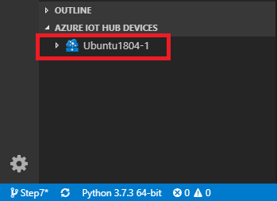
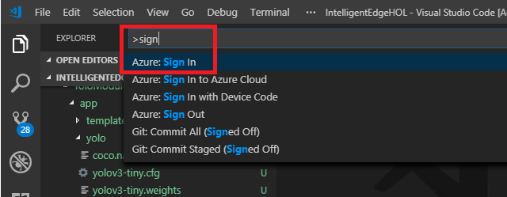
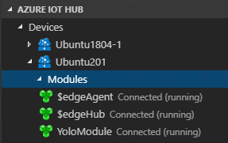
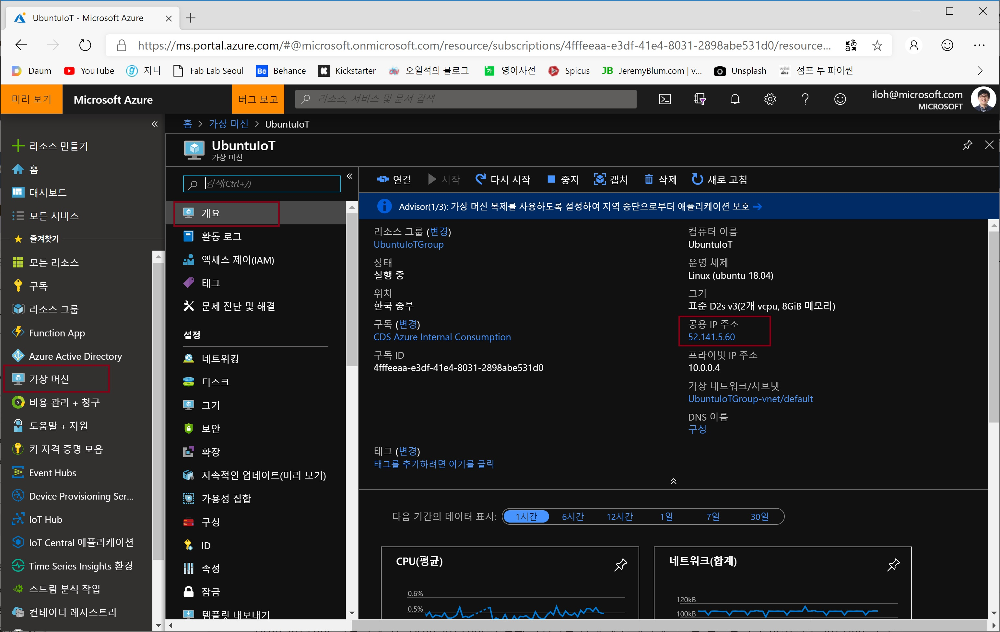
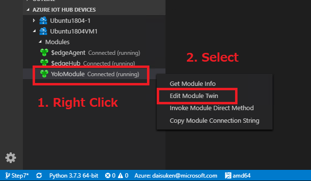
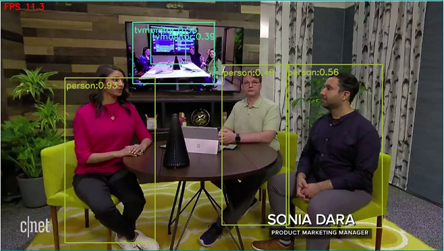
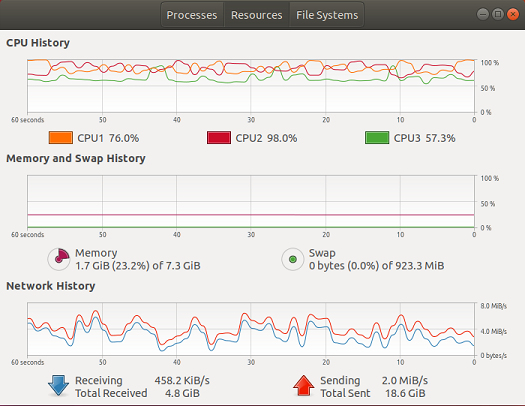

# Intelligent Edge 디바이스 개발

이번 실습은 아래와 같은 내용으로 진행됩니다.

- Azure IoT Edge Runtime 설치
- Azure IoT Edge 모듈을 클론, 수정, 컴파일
- Azure IoT Edge Module의 배포
- 클라우드에서 Azure IoT Ede Module을 관리

## 사전 준비

이번 실습을 완료하기 위해서는 아래와 같은 내용을 알고 계시면 좋습니다.

- Azure IoT Hub의 기본
- [Azure Portal](http://portal.azure.com)의 사용
- **Visual Studio Code**의 사용
- **Ubuntu 18.04**, 터미널 (bash or any console shell), text editor such as gedit, vi, 또는 nano 에디터

## 실습 단계

이번 실습은 총 10단계의 과정과 1개의 옵션과정으로 이루어져 있습니다. Lab 3을 수행하셨다면 이미 만들어져 있는 경우가 있습니다. 그럴 경우 다음 단계로 넘어가면 됩니다. 

- [Step 1:](#step-1--azure-iot-hub) Azure IoT Hub 만들기
- [Step 2:](#step-2--azure-iot-edge-device) IoT Hub에 Azure IoT Edge 디바이스 설정
- [Step 3:](#step-3--azure-iot-edge-runtime-environment) 디바이스(Ubuntu 18.04 가상머신)에 접속
- [Step 4:](#step-5--azure-container-registry) Azure Container Registry (ACR) 만들기
- [Step 5:](#step-4--clone-source-code) 샘플 코드 클론
- [Step 6:](#step-6--modify-sample-code) 샘플 코드 수정
- [Step 7:](#step-7--build-and-push-container-image) Build and Push IoT Edge module without AI
- [Step 8:](#step-8--deploy-module) 컨테이너 배포
- [Step 9:](#step-9--module-twin) 모듈 트위(Module Twin)
- [Step 10:](#step-10--add-ai-inference-to-yolomodule) AI 추가 (Add AI Inference to YoloModule)
- [Step 11:](#step-11--optional-full-yolo-v3-model) (Optional) Full Yolo v3 Model

## 개발환경 (DevEnv)

이번 실습을 위해서는 개발 PC에 아래와 같은 툴이 설치되어야 합니다.

- Windows 10 PC
- (Windows 10 IoT)
- [Visual Studio Code (VSCode)](https://code.visualstudio.com/)
- VSCode Extensions
  - [Azure Account Extension](https://marketplace.visualstudio.com/items?itemName=ms-vscode.azure-account)
  - [Azure IoT Edge Extension](https://marketplace.visualstudio.com/items?itemName=vsciot-vscode.azure-iot-edge)
  - [Docker Extension](https://marketplace.visualstudio.com/items?itemName=PeterJausovec.vscode-docker)
  - [Azure IoT Toolkit Extension](https://marketplace.visualstudio.com/items?itemName=vsciot-vscode.azure-iot-toolkit)
- Git tool(s)  
  [Git command line](https://git-scm.com/) tool
- [Docker Desktop for Windows](https://hub.docker.com/editions/community/docker-ce-desktop-windows)
- [Putty](https://www.chiark.greenend.org.uk/~sgtatham/putty/)

## Target Device: Azure 가상머신 - Ubuntu 18.04

Lab 3에서 이미 Ubuntu 가상 머신을 만들었다면 그대로 사용하면 됩니다.
아직 Ubuntu 가상머신이 없다면 [Lab 3 - Step 0: Ubuntu 가상머신 만들기](../lab3-edge-advanced.md#step-0-ubuntu-가상머신-만들기)를 참조해서 만들어주세요.

## Sample Code / Module

### 모듈 기능

샘플코드틑 3가지 기능을 가지고 있습니다.

- Video Stream  
  모듈은 아래 소스중에 하나에서 비디오 스트림을 입력 받습니다.
  - YouTube Video  
  - RTSP IP Camera  
  - Webcam  
      본 실습에서는 사용하지 못함.

- AI Inference  
  모듈에서 Computer Vision AI 가 작동됩니다.
  모듈에서는 Yolo (You Only Look Once) v3 pre-trained model을 사용합니다. 

- Web Server  
  작은 웹서버를 통해서 영상을 볼 수 있습니다.

### 모듈의 컨트롤과 관리

모듈을 컨트롤하고 관리하는 방법은 두가지가 있습니다.

- Manifest를 통한 배포
  Deployment Manifest 파일의 `createOption` 파라미터 값을 설정하여 시작 시점에 모듈을 셋팅할 수 있습니다.

- 모듈 트윈 (Module Twin)  
  컨테이너가 시작된 후에는 모듈 트윈의 설정값을 변경하면서 모듈을 셋팅할 수 있습니다.
  - VideoSource  
    비디오 스트림 소스

  - ConfidenceLevel  
    Confidence Level threshold. 모듈은 이 설정값 이하의 결과에 대해서는 무시합니다.

  - Verbose  
    Logging verbosity.  디버깅 용

  > [!TIP]  
  > 모듈 트윈의 `desired` 설정을 통해서도 설정을 변경할 수 있습니다.

## Step 1 : Azure IoT Hub  

IoT Hub가 아직 없다면 IoT Hub를 만듭니다.  

> [!TIP]  
> 선호하는 툴을 이용해서 만들 수 있습니다. 

| Tool   | Link                                                                                                                     |
| ------ | ------------------------------------------------------------------------------------------------------------------------ |
| Portal | [Create an IoT hub using the Azure portal](https://docs.microsoft.com/ko-kr/azure/iot-hub/iot-hub-create-through-portal)                            |
| AZ CLI | [Create an IoT hub using the Azure CLI](https://docs.microsoft.com/ko-kr/azure/iot-hub/iot-hub-create-using-cli)                                    |
| VSCode | [Create an IoT hub using the Azure IoT Tools for Visual Studio Code](https://docs.microsoft.com/ko-kr/azure/iot-hub/iot-hub-create-use-iot-toolkit) |

## Step 2 : Azure IoT Edge 디바이스

IoT Edge 디바이스를 Step 1에서 만든 IoT Hub에 만듭니다.  

> [!TIP]  
> 선호하는 툴을 이용해서 IoT Edge 디바이스를 만드세요.

| Tool   | Link                                                                                                               |
| ------ | ------------------------------------------------------------------------------------------------------------------ |
| Portal | [Register a new Azure IoT Edge device from the Azure portal](https://docs.microsoft.com/ko-kr/azure/iot-edge/how-to-register-device-portal)   |
| AZ CLI | [Register a new Azure IoT Edge device with Azure CLI](https://docs.microsoft.com/ko-kr/azure/iot-edge/how-to-register-device-cli)             |
| VSCode | [Register a new Azure IoT Edge device from Visual Studio Code](https://docs.microsoft.com/ko-kr/azure/iot-edge/how-to-register-device-vscode) |

Visual Studio Code의 왼쪽 하단의 Azure IoT Hub 탭에서 새로만든 Edge 디바이스를 확인해주세요. 



## Step 3 : Azure IoT Edge 런타임

### Step 3.1 : Connect to Ubuntu 가상머신(amd64)에 Azure IoT Edge 런타임 설치

Lab 3을 진행하셨다면 이미 설치되어 있는 런타임을 쓰면됩니다. 
새로운 Ubuntu 가상머신에 설치를 해야 한다면 [Lab 3 - Step 4 : Ubuntu에 Azure IoT Edge 런타임 설치하기](../lab3-edge-advanced.md#step-4--ubuntu에-azure-iot-edge-런타임-설치하기)를 참조해서 만들어주세요.

### Step 3.2 : connection 검증

설정이 정상적으로 진행되었다면 Visual Studio Code에 녹색 아이콘(연결상태)을 확인 할 수 있습니다.


## Step 4 : 소스코드 클론

Azure DevOps 리파지토리에 있는 샘플 소스코드를 클론해서 가져옵니다.
`git` 커멘드를 활용합니다.

> [!NOTE]  
> 여기에서는 `C:\Repo` 폴더를 가정합니다.

### Step 4.1 : Git 커멘드로 클론

1. 개발 PC에서 `Command console` (CMD)이나 `Powershell` 콘솔을 실행
1. 폴더 생성 `C:\Repo`
1. `C:\Repo`폴더로 이동
1. `git clone` 커멘드 실행

```bash
md C:\Repo
cd C:\Repo
git clone https://cdsiotbootcamp.visualstudio.com/bootcamp2019/_git/IntelligentEdgeHOL
```

## Step 5 : Azure Container Registry

Azure Container Registry (ACR)를 생성합니다. 
ACR을 통해서

- 개발 PC에서 만든 컨테이너 이미지를 Push  
- Azure IoT Edge runtime 이 Azure IoT Edge module을 ACR에서 다운로드 합니다. 

> [!TIP]  
>  
> - 선호하는 툴을 이용해서 생성  
> - Admin Access 옵션을 선택합니다.
> - Admin 로그인 정보를 확인합니다.

| Tool   | Link                                                                                                                                           |
| ------ | ---------------------------------------------------------------------------------------------------------------------------------------------- |
| Portal | [빠른 시작: Azure Portal을 사용하여 프라이빗 컨테이너 레지스트리 만들기](https://docs.microsoft.com/ko-kr/azure/container-registry/container-registry-get-started-portal)             |
| AZ CLI | [빠른 시작: Azure CLI를 사용하여 프라이빗 컨테이너 레지스트리 만들기](https://docs.microsoft.com/ko-kr/azure/container-registry/container-registry-get-started-azure-cli) |
| PowerShell | [빠른 시작: Azure PowerShell을 사용하여 프라이빗 컨테이너 레지스트리 만들기](https://docs.microsoft.com/ko-kr/azure/container-registry/container-registry-get-started-powershell)         |

## Step 6 : 프로젝트 준비

컨테이너를 컴파일하고 빌드하기 전에 몇 가지 설정을 해야합니다.

### Step 6.1 : 샘플 코드 열기

1. Visual Studio Code 실행Start VSCode On the **Windows 10 DevEnv laptop**, if you have not started yet  

1. `File` -> `Open Folder`  

1. `IntelligentEdgeHOL` 폴더 선택 (이전 단계에서 클론한 샘플 소스코드)   
    예 :  `C:\Repo\IntelligentEdgeHOL`
  
    

### Step 6.1 : Azure 로그인

VSCode 에서 Azure 로그인을 하고 IoT Hub에 연결합니다. 

1. VSCode `Command Palette` 열기
  단축키 `ctrl + shift + p` 또는 `[View] menu -> command palette`
1. `sign` 을 입력하면  `Azure : Sign in` 메뉴가 보입니다.
   `Azure : Sign in` 을 선택합니다.
  
  

1. 로그인 과정을 진행합니다. 브라우저가 자동으로 열립니다.
  
  

### Step 6.2 : ACR 로그인 정보 가져오기

ACR에 컨테이너 이미지를 Push/Pull 하려면 ACR 로그인 정보가 필요합니다.

#### Option 1 : Azure 포탈  

Azure 포탈에서 확인 할 수 있습니다. 

  

#### Option 2 : AZ CLI  

1. VSCode `Terminal`을 열고 

1. `az acr credential show --name <ACR Name>` 명령을 실행하면 정보를 얻을 수 있습니다.  

> [!TIP]  
>  
> ACR 로그인 서버이름은 `<ACR Name>`.**azurecr.io**  입니다.
>  
> 예 : ACR Name = myregistry  
> 로그인서버 : myregistry.azurecr.io

```bash
PS C:\repo\bootcamp-labs> az acr credential show --name myregistry
{
  "passwords": [
    {
      "name": "password",
      "value": "ABCDEFG1234567890!@#$%^&*()_+"
    },
    {
      "name": "password2",
      "value": "password1234567890!@#$%^&*()_"
    }
  ],
  "username": "myregistry"
}
```

### Step 6.3 : ACR 로그인

VSCode 에서 컨테이너 이미지를 Push 하기 위해서 ACR 로그인을 해야합니다.

1. VSCode `Terminal` 열기

  **ctrl + \`** 또는 **[View] menu -> Terminal**

  

1. `docker` 명령으로 ACR 로그인

  ```bash
  docker login -u <ACR User Name> -p <ACR Password> <ACR Login Server>
  ```

  예:
  
  ```bash
    PS C:\Repo\IntelligentEdgeHOL> docker login -u myregistry -p ABCDEFG1234567890!)^%ddrd myregistry.azurecr.io
    WARNING! Using --password via the CLI is insecure. Use --password-stdin.
    Login Succeeded
  ```

### Step 6.4 : `.env` 파일 수정

이 과정은 모듈 배포와 관련 있습니다. deployment manifest 파일은 ACR의 로그인 정보를 포함합니다. 이 정보를 이용하여 Azure IoT Edge 런타임이 ACR에 로그인하여 컨테이너 이미지를 Pull 할 수 있습니다.  

`.env` 파일에 ACR 로그인 정보를 업데이트 합니다. 

1. `.env` 을 선택
1. ACR Login Server, User Name, Password 이전 과정에서 얻은 정보 업데이트

  

  예 :
  
  ```bash
  CONTAINER_REGISTRY_URL=bootcampfy19acr.azurecr.io
  CONTAINER_REGISTRY_USERNAME=bootcampfy19acr
  CONTAINER_REGISTRY_PASSWORD=abcdefg1234567890
  ```

### Step 6.5 : Video 소스 URL

1. 웹브라우저를 열어서 [http://www.youtube.com](http://www.youtube.com)에 접속
1. 비디오 선택
1. 비디오 창에서 `Right Click`하여 `Copy video URL` 클릭

  > [!TIP]  
  > Yolo pre-trained model이 인식할 수 있는 물건들이 나오는 영상을 골르면 좋습니다. 
  > [오브젝트 리스트](#yolo-pre-trained-model)를 확인해보세요.

  

  예 :
  
  ```bash
  CONTAINER_VIDEO_SOURCE=https://www.youtube.com/watch?v=YZkp0qBBmpw
  ```

## Step 7 : Build and Push Container Image

이제 컨테이너 이미지를 빌드하고 ACR에 업로드(push)해 봅시다.Let's build the module and the container and upload (Push) the container to ACR

1. docker가 linux container 모드로 작동해야 합니다. 
  
  -  Task Tray에서 Docker Icon을 오른쪽 클릭
  

  - **Switch to Linux Containers...**  선택
  
  메뉴가 **Switch to Windows Containers...**라면 이미 Linux Containers 모드 입니다.

    

1. VSCode 에서`deployment.template.json` 파일을 찾아서 오른쪽 클릭합니다.

1. `Build and Push IoT Edge Solution` 선택

    

1. 빌드와 Push가 끝날때 까지 기다립니다. 
  `terminal window`에서 진행상황을 체크합니다.

1. `config` 폴더가 생기고 그 안에 `deployment.amd64.json` 파일이 있는지 확인 합니다. 

    

## Step 8 : 모듈 배포

첫번째 모듈에서는 비디오 스트림을 읽어서 웹 UI에 표시하는 기본 기능만 들어 있습니다. 
계속 진행하면 AI 기능을 모듈에 추가할 것입니다. 

### Manifest 배포

Deployment Manifest에는 이런 내용들이 들어 있습니다. 

- Container Registry 로그인 정보
- Modules  
  - System Modules (`$edgeAgent` and `$edgeHub`)
  - Custom Modules
- Source of modules (Registry)
- Module versions
- Module settings
- Initial Module Twin (Desired Property)
- Message Routes

모듈을 배포하는 방법은 여러가지가 있습니다. 

| Tool   | Link                                                                                                       |
| ------ | ---------------------------------------------------------------------------------------------------------- |
| Portal | [Azure Portal에서 Azure IoT Edge 모듈 배포](https://docs.microsoft.com/ko-kr/azure/iot-edge/how-to-deploy-modules-portal)   |
| AZ CLI | [Azure CLI를 사용하여 Azure IoT Edge 모듈 배포](https://docs.microsoft.com/ko-kr/azure/iot-edge/how-to-deploy-modules-cli)             |
| VSCode | [Visual Studio Code에서 Azure IoT Edge 모듈 배포](https://docs.microsoft.com/ko-kr/azure/iot-edge/how-to-deploy-modules-vscode) |

[Deployment Manifest](https://docs.microsoft.com/ko-kr/azure/iot-edge/module-composition)에 대한 상세 정보

### Step 8.1 : VSCode에서 AI 기능이 없는 `YoloModule` 배포

VSCode에서 `YoloModule` 컨테이너를 배포합니다. 

1. `deployment.amd64.json`에서 오른쪽 클릭

1. `Create Deployment for Single Device` 선택

    

1. VSCode 상단에 디바이스 선택 윈도우 확인

1. Ubuntu 디바이스에서 `edgeAgent` 로그를 살펴봅니다.  

    > [!TIP]
    >  
    > 아래 명령으로 모듈의 로그를 확인 할 수 있습니다.
    >
    > `sudo docker logs -f edgeAgent`  
    > `sudo iotedge logs -f edgeAgent`  
    >  
    > `-f` : option is to *follow* logging  
    > `--tail <number>` : show last N lines  
    >  
    > `sudo docker logs -f YoloModule --tail 100
  
    출력 예제

    ```bash
    2019-05-15 01:34:09.314 +00:00 [INF] - Executing command: "Command Group: (
      [Create module YoloModule]
      [Start module YoloModule]
    )"
    2019-05-15 01:34:09.314 +00:00 [INF] - Executing command: "Create module YoloModule"
    2019-05-15 01:34:09.886 +00:00 [INF] - Executing command: "Start module YoloModule"
    2019-05-15 01:34:10.356 +00:00 [INF] - Plan execution ended for deployment 10
    2019-05-15 01:34:10.506 +00:00 [INF] - Updated reported properties
    2019-05-15 01:34:15.666 +00:00 [INF] - Updated reported properties
    ```

1. `YoloModule`의 배포와 실행 확인

    > [!TIP]
    >  
    > 아래 명령으로 모듈 리스트를 볼 수 있습니다.
    >
    > `sudo iotedge list`  
    > `sudo docker ps`  
    >
    > `-a` option 은 실행되지 않는 모듈을 표시합니다.

    ```bash
    iotbootcamp@Ubuntu201:~$ sudo iotedge list
    NAME             STATUS           DESCRIPTION      CONFIG
    edgeAgent        running          Up 11 hours      mcr.microsoft.com/azureiotedge-agent:1.0
    edgeHub          running          Up 11 hours      mcr.microsoft.com/azureiotedge-hub:1.0
    YoloModule       running          Up 36 seconds    bootcampfy19acr.azurecr.io/yolomodule:step7-8-amd64

    iotbootcamp@Ubuntu201:~$ sudo docker ps
    CONTAINER ID        IMAGE                                                 COMMAND                   CREATED             STATUS              PORTS                                                                  NAMES
    2357e72e612b        bootcampfy19acr.azurecr.io/yolomodule:step7-8-amd64   "python -u ./main.py"     3 minutes ago       Up 3 minutes        0.0.0.0:80->80/tcp                                                     YoloModule
    ecde10a04f2b        mcr.microsoft.com/azureiotedge-hub:1.0                "/bin/sh -c 'echo \"$…"   12 hours ago        Up 12 hours         0.0.0.0:443->443/tcp, 0.0.0.0:5671->5671/tcp, 0.0.0.0:8883->8883/tcp   edgeHub
    46771922a8b9        mcr.microsoft.com/azureiotedge-agent:1.0              "/bin/sh -c 'echo \"$…"   12 hours ago        Up 12 hours                                                                                edgeAgent
    ```

    > [!TIP]  
    >  
    > VSCode에서도 모듈 상태를 확인 가능합니다.  
    > 

### Step 8.2 : 배포결과 확인

웹브라우저를 통해서 모듈이 잘 작동하는지 확인 합니다. Confirm the module is working as expected by accessing the web server.

1. Azure Portal에서 Ubuntu 가상머신의 Public IP를 확인합니다.
  
  

1. 브라우저에서 접속 합니다. 

  http://[Ubuntu 디바이스 IP]

1. 비디오 스트림을 확인 할 수 있습니다.

    

1. `YoloModule`의 로그를 확인 합니다.

    ```bash
    iotbootcamp@Ubuntu201:~$ sudo docker logs -f YoloModule --tail 50
    [youtube] unPK61Hz3Rw: Downloading webpage
    [youtube] unPK61Hz3Rw: Downloading video info webpage
    [download] Destination: /app/video.mp4
    [download] 100% of 43.10MiB in 00:0093MiB/s ETA 00:00known ETA
    Download Complete
    ===============================================================
    videoCapture::__Run__()
       - Stream          : False
       - useMovieFile    : True
    Camera frame size    : 1280x720
           frame size    : 1280x720
    Frame rate (FPS)     : 29

    device_twin_callback()
       - status  : COMPLETE
       - payload :
    {
        "$version": 4,
        "Inference": 1,
        "VerboseMode": 0,
        "ConfidenceLevel": "0.3",
        "VideoSource": "https://www.youtube.com/watch?v=tYcvF8o5GXE"
    }
       - ConfidenceLevel : 0.3
       - Verbose         : 0
       - Inference       : 1
       - VideoSource     : https://www.youtube.com/watch?v=tYcvF8o5GXE

    ===> YouTube Video Source
    Start downloading video
    WARNING: Assuming --restrict-filenames since file system encoding cannot encode all characters. Set the LC_ALL environment variable to fix this.
    [youtube] tYcvF8o5GXE: Downloading webpage
    [youtube] tYcvF8o5GXE: Downloading video info webpage
    [download] Destination: /app/video.mp4
    [download] 100% of 48.16MiB in 00:0080MiB/s ETA 00:00known ETA
    Download Complete
    ```

### Step 9 : 모듈 트윈

모듈 트윈을 통해서 비디오 스트림 소스를 변경해 보겠습ㄴ디ㅏ. Let's change Youtube video through Module Twin.  

1. VSCode의 `Azure IoT Hub Devices` 윈도우에서 `YoloModule` 모듈을 확인 합니다. 

1. `YoloModule`에서 오른쪽 클릭
1. `Edit Module Twin`을 선택

    

1. `azure-iot-module-twin.json`파일이 열림

    > [!TIP]
    >  
    > `ctrl + B`를 눌러서 사이드바를 접에서 크게 볼 수 있습니다.
    >
    >   

1. `desired` -> `VideoSource` 를 다른 비디오 URL로 변경합니다.

    

1. 편집 윈도우 위에서 오른쪽 클릭하고 `Update Module Twin`를 선택합니다.

    

1. 비디오 크기에 따라 새로운 비디오가 웹브라우저에 표시되기까지 시간이 걸릴 수 있습니다.

## Step 10 : YoloModule 기능 추가

비디오의 각 프레임을 AI 에 보내 물체를 인식 할 수 있습니다. 이 실습을 위해 pre-trained [Yolo v3](https://pjreddie.com/darknet/yolo/) object detection model을 사용합니다.
[Cognitive Services Custom Vision](https://www.customvision.ai/)를 사용해서 나만의 컴퓨터 비전 모델을 만들 수도 있습니다. 

### Step 10.1 : Source Code 수정

샘플 코드에서는 AI 기능이 꺼져 있습니다. 아래 코드를 다시 살려서 켜줍니다.

- VSCode에서 `VideoCapture.py` 파일 열기
- 아래 코드 블록을 찾습니다.

    ```python
    '''***********************************************************
    Step-10 : Uncomment Start
    ***********************************************************'''
    # import YoloInference
    # from YoloInference import YoloInference
    '''***********************************************************
    Step-10 : Uncomment End
    ***********************************************************'''
    ```

- 아래 코드에서 `#`을 제거합니다.
  - Line 19,20  
    Imports AI Inference Class)
  - Line 69  
    Initialization of the class
  - Line 293 and 294  
    Sends frame (Picture) to Yolo inference

> [!TIP]  
>  
> 라인번호는 VSCode 아래 상태바에서 확인 가능합니다.
>  
> 

### Step 10.2 : Module Tag 업데이트

컨테이너 모듈 이름은 몇 가지 파트로 이뤄져 있습니다.The name of Container module is consist of multiple parts.

1. 레지스트리 주소
  
1. 컨테이너 이름  
  예 : YoloModule

1. 아키텍쳐 / 플랫폼  
  예 : amd64, arm32

1. 태그  
  보통 버전 번호를 활용합니다.

예

```bash
myregistry.azurecr.io/yolomodule:Step10-amd64
```

`Tag`는 `.env` 파일에서 변경 할 수 있습니다.

예

```bash
CONTAINER_MODULE_VERSION=Step7-8

-->

CONTAINER_MODULE_VERSION=Step10
```

### Step 10.3 : 다시 빌드하고 배포

[Step 7](#step-7--build-and-push-container-image), [Step 8](#step-8--deploy-module) 을 반복하여 다시 빌드하고 배포합니다.module

### Step 10.4 : 새로운 모듈이 배포 및 작동 확인

새로운 모듈이 배포되면 브라우저를 리프레시 합니다. 이제는 YoloModule이 각 프레임을 AI로 보내고 AI 모델은 confidence level 이상이면 박스를 그리고 라벨을 출력합니다.

예

```bash
iotbootcamp@Ubuntu201:~$ sudo iotedge list
NAME             STATUS           DESCRIPTION      CONFIG
edgeHub          running          Up a minute      mcr.microsoft.com/azureiotedge-hub:1.0
edgeAgent        running          Up a minute      mcr.microsoft.com/azureiotedge-agent:1.0
YoloModule       running          Up a minute      bootcampfy19acr.azurecr.io/yolomodule:Step10-amd64
```

> [!TIP]  
>  
> 배포 상황을 알기 위해서는 $edgeAgent 로그를 살펴보면 됩니다.
> 명령 : `iotedge logs edgeAgent`



AI가 실행되면

- Frame Rate (FPS) 가 떨어집니다.
- 때로는 AI 가 오브젝트를 놓치기도 합니다.

실습에서는 Ubuntu 가상머신을 사용합니다. 시스템 모니터링을 보면 AI 모듈은 CPU를 많이 쓰는 작업임을 알 수 있습니다. 여기서 쓴 AI 모델을 `Tiny Yolo`이라고 부릅니다. Tiny Yolo는 GPU나 FPGA를 쓰지 않는(하드웨어 가속을 쓰지 않는) Yolo모델의 가벼운 버전입니다.



AI 기능은 모듈 트윈에서 `Inference` 를 0으로 설정해서 끌 수 있습니다. 

```json
    },
    "version": 21,
    "properties": {
        "desired": {
            "ConfidenceLevel": "0.3",
            "VerboseMode": 0,
            "Inference": 1,   <<====
            "VideoSource": "",
            "$metadata": {
```


## Step 11 : (Optional) Full Yolo v3 Model

[Step 10](#step-10--add-ai-inference-to-yolomodule)에서 사용한 Yolo v3 pre-trained model은 Tiny-Yolo 입니다. 
Full Yolo v3 model `Yolo-Full` 브랜치에 있습니다. 

1. `Yolo-Full` branch 를 클론합니다. 

  ```bash
  git clone https://cdsiotbootcamp.visualstudio.com/bootcamp2019/_git/IntelligentEdgeHOL -b Yolo-Full c:\Repo\YoloFull
  ```

1. `.env` 파일 수정
1. 컨테이너 빌드 및 Push
1. 모듈 배포
1. 브라우저에서 확인

> [!WARNING]  
> Pre-trained Yolo v3 model 파일 사이즈는 240MB라서  Clone, push, pull 에 시간이 걸립니다.

Full AI Model을 쓰면 오브젝트 인식률이 좋아지지만 FPS 가 낮아집니다. 

## Yolo Pre-trained Model 오브젝트 리스트

```text
person
bicycle
car
motorbike
aeroplane
bus
train
truck
boat
traffic light
fire hydrant
stop sign
parking meter
bench
bird
cat
dog
horse
sheep
cow
elephant
bear
zebra
giraffe
backpack
umbrella
handbag
tie
suitcase
frisbee
skis
snowboard
sports ball
kite
baseball bat
baseball glove
skateboard
surfboard
tennis racket
bottle
wine glass
cup
fork
knife
spoon
bowl
banana
apple
sandwich
orange
broccoli
carrot
hot dog
pizza
donut
cake
chair
sofa
pottedplant
bed
diningtable
toilet
tvmonitor
laptop
mouse
remote
keyboard
cell phone
microwave
oven
toaster
sink
refrigerator
book
clock
vase
scissors
teddy bear
hair drier
toothbrush
```
